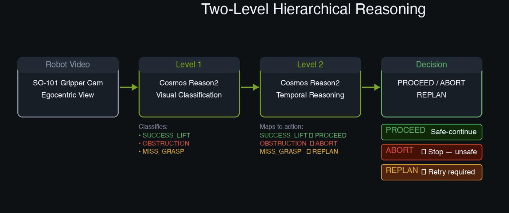
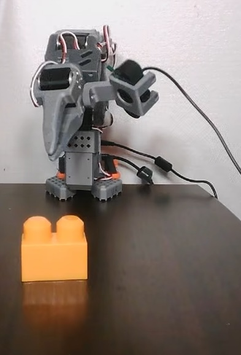

# Cosmos Robot Supervisor
**Hierarchical Vision-Based Safety Monitoring for Physical AI**

[](https://github.com/AIBotTeachesAI/cosmos-robot-supervisor)
[](#)
[](#)

> 🎯 **Vision-based supervisor using NVIDIA Cosmos Reason2 to monitor real robot manipulation tasks and make safety decisions**

## Architecture Diagram

<p align="center">
  
</p>

<p align="center">
  
</p>


---

## 🎬 Demo Video

**👉 [Watch 3-minute demo here](assets/demo_video.mp4)**

See the system supervise a real SO-101 robotic arm across success, obstruction, and failure scenarios.

---

## 🔥 The Problem

Robots don't fail because motion planning breaks — they fail because **the world changes**:

- A human hand enters the workspace → **collision risk**
- An object slips from the gripper → **task failure**
- An obstacle appears unexpectedly → **unsafe to continue**

Traditional robots can't recognize these situations from vision alone. They need explicit rules for every edge case, or they silently proceed into failure.

**This project solves that** by adding a vision-based supervisor that watches the robot and decides: should it proceed, stop, or retry?

---

## ✨ What We Built

A **hierarchical reasoning system** using NVIDIA Cosmos Reason2 that monitors a real robotic arm performing block manipulation and outputs structured safety decisions.

### System Architecture

```
Robot Egocentric Video (15s)
         ↓
┌─────────────────────────────────┐
│  Level 1: Visual Classification │  ← Cosmos Reason2
│  Detects: SUCCESS_LIFT /        │
│           OBSTRUCTION /          │
│           MISS_GRASP             │
└─────────────────────────────────┘
         ↓
┌─────────────────────────────────┐
│  Level 2: Decision Mapping      │  ← Cosmos Reason2
│  Maps to: PROCEED /              │
│           ABORT /                │
│           REPLAN                 │
└─────────────────────────────────┘
         ↓
    Supervisor Decision
```

**Key Design Principle:** Cosmos Reason2 acts as a **reasoning layer only** — it does not control the robot. It supervises and advises.

---

## 🎯 Results

Tested on real SO-101 robotic arm with egocentric gripper camera.

| Scenario | Visual Evidence | Level 1 Classification | Level 2 Decision | Confidence |
|----------|----------------|----------------------|-----------------|------------|
| **Safe Grasp** | Block lifted and held in gripper | SUCCESS_LIFT | ✅ **PROCEED** | 99% |
| **Obstruction** | Soft toy blocks gripper path | OBSTRUCTION | 🛑 **ABORT** | 99% |
| **Grasp Failure** | Block pushed down / not lifted/ block moved | MISS_GRASP | 🔄 **REPLAN** | 99% |

**All scenarios correctly classified with high confidence.**

### Example Output (Approach 1)

```json
{
  "action": "PROCEED",
  "why": "The orange block is clearly lifted off the surface and held in the gripper",
  "confidence": 0.99
}
```

---

## 💡 Key Insight: Why Full-Context Reasoning Wins

We explored two architectural approaches:

### Approach Comparison

| Aspect | **Approach 1** ✅ (Final) | Approach 2 (Explored) |
|--------|--------------------------|----------------------|
| **Level 1 Input** | Full 15s video | 2s sliding window clips |
| **Level 1 Prompt** | Task-specific labels | Generic "describe what you see" |
| **Level 1 Output** | Structured JSON directly | Natural language → heuristics needed |
| **Level 2** | Clean label→action mapping | Rule-based state extraction |
| **Result** | 99% confidence, consistent | Inconsistent, required heavy post-processing |

**Key Learning:** 
Vision-based reasoning systems achieve highest reliability when given **complete temporal context** paired with **task-specific output schemas**. Our experiments showed that 2-second sliding windows, while providing fine-grained temporal detail, fragment the manipulation sequence and make success/failure distinctions less clear—particularly for small objects where context across the full action matters.


This architectural insight is the project's core contribution — demonstrating how input scope and prompt structure directly impact decision reliability in physical AI systems.
---

## ⚙️ Hardware Setup

- **Robot:** SO-101 Robotic Arm
- **Camera:** Gripper-mounted (egocentric view)
- **Environment:** Garage workspace with brown table
- **Object:** Orange Lego block
- **Inference:** GCP Deep Learning VM with L4 GPU (24GB)
- **Model:** NVIDIA Cosmos Reason2-2B

<p align="center">
  
</p>

---

## 🚀  Installation & Usage


📖 **Full installation guide:** See [SETUP.md](SETUP.md)

---

## 📁 Repository Structure

```
cosmos-robot-supervisor/
│
├── src/
│   ├── approach1/                    # Final pipeline (full-video reasoning)
│   │   ├── level1_classify_full_video.py
│   │   ├── run_level1_all.py         # Convenience wrapper
│   │   └── level2_from_fullvideo_files.py
│   │
│   └── approach2_exploration/        # Alternative approach (sliding clips)
│       ├── level1_explain_batch_state_label.py
│       ├── level2_from_label_files.py
│       └── video_utils/
│           └── make_slowmo_and_sliding_clips.sh
│
├── videos/
│   ├── inputs/                       # Original test videos
│   │   ├── success/
│   │   ├── obstruction/
│   │   └── push_down/
│   │
│   └── approach2_exploration/
│       └── derived_inputs/           # Generated clips for Approach 2
│
├── outputs/
│   ├── approach1/                    # Results from final pipeline
│   │   ├── level1_fullvideo_*.jsonl
│   │   ├── level2_fullvideo_*.json
│   │   └── summary.json              # All scenarios
│   │
│   └── approach2_exploration/        # Results from exploratory approach
│
├── assets/
│   ├── demo_video.mp4
│   ├── architecture_diagram.png
│   ├── demo_preview.gif
│   └── so_101.jpg                        # Hardware setup photo
│ 
├── README.md
├── SETUP.md                          # Detailed installation guide
└── requirements.txt
```

---

## 🔬 Technical Details

### Level 1: Visual Classification

Cosmos Reason2 analyzes the full 15-second manipulation video and outputs structured classification:

**Prompt Strategy:**
- Task-specific labels (SUCCESS_LIFT, OBSTRUCTION, MISS_GRASP)
- Forces structured JSON output
- Includes visual evidence bullets

**Why this works:** Clear label space + full temporal context = reliable classification.

### Level 2: Supervisor Decision

Cosmos Reason2 maps Level 1 classification to actionable supervisor decision:

```
SUCCESS_LIFT → PROCEED (safe to continue)
OBSTRUCTION  → ABORT   (unsafe, stop immediately)
MISS_GRASP   → REPLAN  (retry required)
```

**Design note:** Level 2 is intentionally simple — this is a **decision mapping layer**, not complex reasoning. The heavy reasoning happens in Level 1.

---

## 🎓 What We Learned

### ✅ What Worked
- **Full-context reasoning:** 15s videos captured complete manipulation sequences more reliably than 2s clips
- **Structured prompting:** Task-specific labels provided clearer output than open-ended descriptions
- **Two-level hierarchy:** Separating classification from decision mapping improved interpretability

### 🔍 What We Explored
- **Sliding window approach:** Enabled frame-by-frame analysis but fragmented action sequences
- **Heuristic state extraction:** Required additional processing to convert natural language observations into structured states
- **Temporal aggregation:** Aggregating temporal state proved effective when input representations were well-formed

### 💭 Key Takeaway


Vision-based reasoning for physical AI benefits significantly from **thoughtful prompt engineering and input design**. Providing complete temporal context and structured output schemas—rather than fragmented clips and open-ended prompts—led to more consistent and confident supervisory decisions in our experiments.
---

## 🚧 Future Work

- **Cosmos Predict integration:** Visualize predicted failure trajectories after REPLAN decision
- **Multi-camera fusion:** Combine gripper + external camera views for spatial reasoning
- **Multi-step tasks:** Extend to longer manipulation sequences (stack, pour, handover)
- **Real-time deployment:** Integrate with robot control loop for live supervision

---

## 📊 Impact

This system demonstrates a **practical safety layer** for physical AI:

✅ **Safer human-robot collaboration** — detects workspace intrusions  
✅ **Early failure detection** — catches handling errors before damage  
✅ **Operational reliability** — reduces silent failures in deployment  
✅ **Generalizable approach** — same architecture applies to other manipulation tasks  

The hierarchical reasoning pattern shown here can be adapted to autonomous vehicles, warehouse robots, surgical systems, and any physical AI that needs vision-based safety monitoring.

---

## 🙏 Acknowledgments

Built for **NVIDIA Cosmos Cookoff 2026**

**Powered by:**
- [NVIDIA Cosmos Reason2](https://github.com/nvidia-cosmos/cosmos-reason2) — Foundation model for physical AI reasoning
- SO-101 Robotic Arm — Real hardware testing platform
- GCP Deep Learning VMs — GPU infrastructure

**Special thanks to:**
- NVIDIA Cosmos team for the incredible reasoning model and documentation
- Competition organizers and community support via Discord
- Open-source robotics community

---

<p align="center">
  <strong>🤖 Built with real hardware · 🧠 Powered by Cosmos Reason2 · 🏆 NVIDIA Cosmos Cookoff 2026</strong>
</p>
